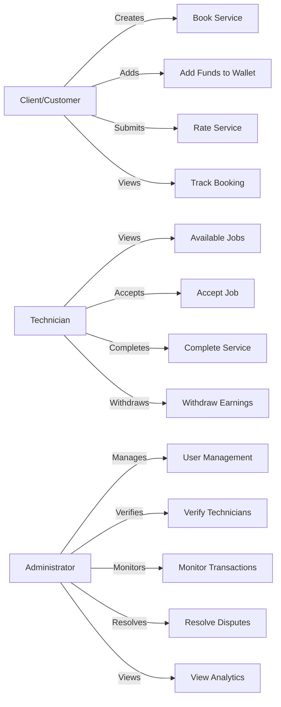
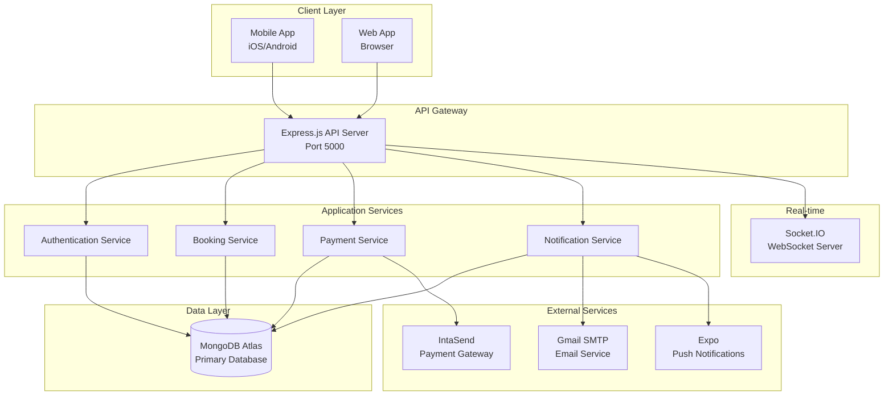
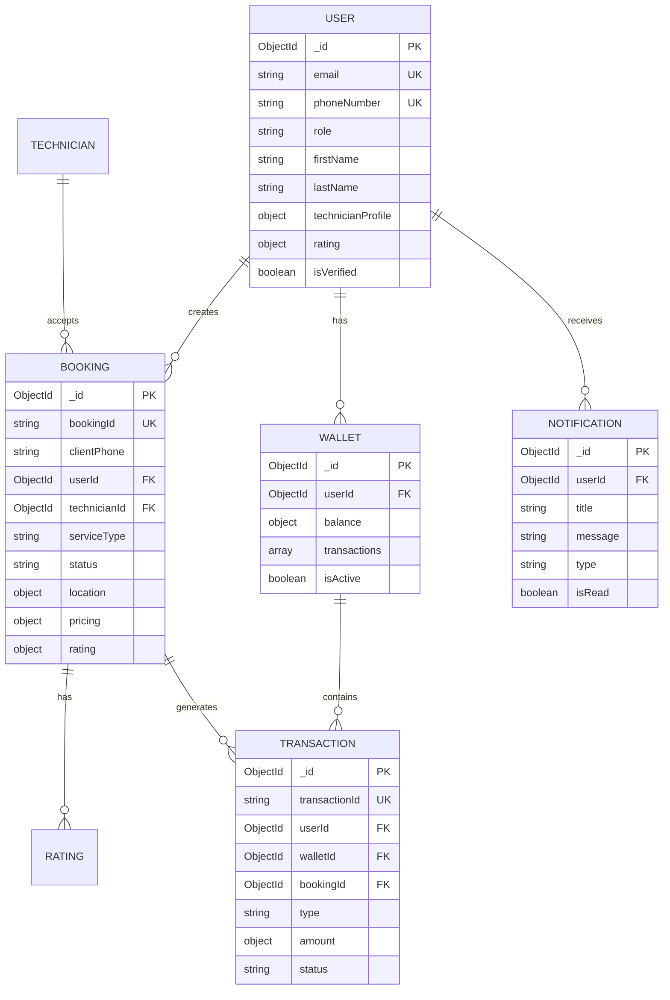
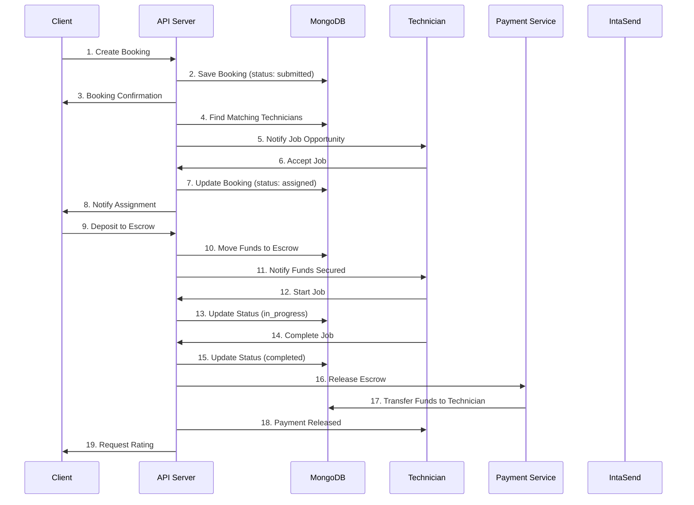

# QuickFix - Home Service Platform
## Comprehensive Technical Documentation

// Added: Formal document header with revision tracking
**Prepared by:** Eng. Kelvin Mwania / QuickFix Development Team 
**Document Version:** 2.0.0 
**Original Date:** October 27, 2025 
**Revision Date:** October 29, 2025 
**Edited by:** GitHub Copilot 
**Status:** Final - Ready for PDF/Word Export

**Project Type:** Full-Stack Mobile & Web Application 
**Technology Stack:** React Native (Expo), Node.js, MongoDB, IntaSend Payment Gateway 
**Target Platform:** Android, iOS, Web 
**Primary Market:** Kenya (Nairobi Metropolitan Area)

---

// Added: Professional Table of Contents with section anchors
## Table of Contents

*Note: Auto-generate TOC when exporting to Word/PDF*

1. [Executive Summary](#1-executive-summary)
2. [Introduction](#2-introduction)
 - 2.1 [Project Overview](#21-project-overview)
 - 2.2 [Problem Statement](#22-problem-statement)
 - 2.3 [Solution Overview](#23-solution-overview)
 - 2.4 [Target Audience](#24-target-audience)
 - 2.5 [Document Purpose](#25-document-purpose)
3. [System Architecture](#3-system-architecture)
 - 3.1 [Technology Stack](#31-technology-stack)
 - 3.2 [System Diagrams](#32-system-diagrams)
 - 3.3 [Project Structure](#33-project-structure)
4. [Core Features Implementation](#4-core-features-implementation)
 - 4.1 [Authentication System](#41-authentication-system)
 - 4.2 [Booking System](#42-booking-system)
 - 4.3 [Payment Integration](#43-payment-integration-intasend)
 - 4.4 [Notification System](#44-notification-system)
 - 4.5 [Rating & Review System](#45-rating--review-system)
5. [Administrative Features](#5-administrative-features)
 - 5.1 [Admin Dashboard](#51-admin-dashboard)
 - 5.2 [User Management](#52-user-management)
 - 5.3 [Analytics & Reporting](#53-analytics--reporting)
6. [Database Design](#6-database-design)
 - 6.1 [MongoDB Collections](#61-mongodb-collections)
 - 6.2 [Entity Relationship Diagram](#62-entity-relationship-diagram)
 - 6.3 [Database Indexes](#63-database-indexes)
7. [API Documentation](#7-api-documentation)
 - 7.1 [API Overview](#71-api-overview)
 - 7.2 [Authentication Endpoints](#72-authentication-endpoints)
 - 7.3 [Booking Endpoints](#73-booking-endpoints)
 - 7.4 [Payment Endpoints](#74-payment-endpoints)
 - 7.5 [Response Formats](#75-response-formats)
8. [Security Implementation](#8-security-implementation)
 - 8.1 [Authentication Security](#81-authentication-security)
 - 8.2 [API Security](#82-api-security)
 - 8.3 [Payment Security](#83-payment-security)
9. [Testing Strategy](#9-testing-strategy)
 - 9.1 [Unit Testing](#91-unit-testing)
 - 9.2 [Integration Testing](#92-integration-testing)
 - 9.3 [End-to-End Testing](#93-end-to-end-testing)
 - 9.4 [Test Coverage](#94-test-coverage)
10. [Deployment Guide](#10-deployment-guide)
 - 10.1 [Prerequisites](#101-prerequisites)
 - 10.2 [Environment Configuration](#102-environment-configuration)
 - 10.3 [Deployment Steps](#103-deployment-steps)
 - 10.4 [CI/CD Pipeline](#104-cicd-pipeline)
11. [Maintenance & Monitoring](#11-maintenance--monitoring)
 - 11.1 [Monitoring Setup](#111-monitoring-setup)
 - 11.2 [Backup Strategy](#112-backup-strategy)
 - 11.3 [Maintenance Schedule](#113-maintenance-schedule)
12. [Future Enhancements](#12-future-enhancements)
 - 12.1 [Short-term Roadmap](#121-short-term-roadmap-q1-2026)
 - 12.2 [Mid-term Roadmap](#122-mid-term-roadmap-q2-2026)
 - 12.3 [Long-term Roadmap](#123-long-term-roadmap-q3-2026)
13. [Known Issues & Limitations](#13-known-issues--limitations)
14. [Conclusion & Recommendations](#14-conclusion--recommendations)
15. [References](#15-references)
16. [Appendices](#16-appendices)

---

// Revised: Expanded Executive Summary with clear stakeholder-friendly language
## 1. Executive Summary

QuickFix is a comprehensive digital platform designed to connect homeowners and businesses with qualified, vetted technicians for home repair and maintenance services across Kenya. The system addresses the challenge of finding reliable service providers by creating a trusted marketplace with built-in quality assurance, secure payment processing, and transparent service delivery tracking.

### 1.1 Key Features

// Revised: Removed emojis, added descriptive labels
The platform provides the following core capabilities:

**User Management:**
- Multi-role authentication system supporting three user types: Clients (service requesters), Technicians (service providers), and Administrators (platform managers)
- Secure account creation and management with email verification
- Role-based access control ensuring appropriate permissions for each user type

**Service Booking:**
- Phone-number-based booking system allowing both registered and guest users to request services
- Intelligent technician matching algorithm based on location, skills, availability, and ratings
- Real-time booking status tracking from submission through completion

**Payment Processing:**
- Integration with IntaSend payment gateway for M-Pesa mobile money transactions
- Secure wallet system for managing funds
- Escrow payment protection holding funds until service completion
- Transparent fee structure with automatic calculation

**Communication:**
- Multi-channel notification system using email, SMS, push notifications, and in-app alerts
- Real-time updates on booking status changes
- Emergency alert system for urgent service requests

**Quality Assurance:**
- Customer rating and review system for completed services
- Technician verification and vetting process
- Performance tracking and quality metrics

**Administrative Control:**
- Comprehensive admin dashboard for platform oversight
- User management and technician verification tools
- Financial reporting and transaction monitoring
- Dispute resolution mechanisms

### 1.2 Technology Foundation

The QuickFix platform utilizes modern, scalable technologies:

- **Frontend**: React Native with Expo framework enables cross-platform mobile applications for both Android and iOS devices from a single codebase
- **Backend**: Node.js with Express.js provides a robust, performant server environment capable of handling concurrent requests efficiently
- **Database**: MongoDB Atlas cloud database offers flexible document storage with automatic scaling and built-in redundancy
- **Payment Gateway**: IntaSend integration enables secure M-Pesa transactions, the dominant mobile money platform in Kenya
- **Real-time Communication**: Socket.IO WebSocket implementation provides instant bidirectional communication for live updates

### 1.3 Target Market

**Primary Users:**
- **Homeowners**: Individuals requiring home repair, maintenance, or installation services
- **Businesses**: Commercial properties needing facility maintenance and repair services
- **Technicians**: Qualified service providers seeking consistent work opportunities
- **Property Managers**: Professionals managing multiple properties requiring regular maintenance

**Geographic Focus:**
- Initial deployment targets Nairobi Metropolitan Area
- System architecture supports expansion to additional Kenyan cities
- Location-based matching optimized for urban environments

### 1.4 Business Value

The QuickFix platform delivers measurable value to all stakeholders:

**For Customers:**
- Reduces time spent searching for reliable technicians from hours to minutes
- Provides transparent pricing before service commitment
- Offers payment protection through escrow system
- Ensures service quality through rating system

**For Technicians:**
- Provides consistent job opportunities through automated matching
- Eliminates payment collection challenges with digital wallet system
- Builds professional reputation through verified reviews
- Reduces idle time between jobs

**For Platform Operators:**
- Generates revenue through transaction fees (20% of service cost)
- Creates scalable business model with low marginal costs
- Builds valuable data on service demand and provider performance
- Establishes market position in growing gig economy sector

---

// Added: New comprehensive Introduction section
## 2. Introduction

### 2.1 Project Overview

QuickFix represents a digital transformation of the traditional home service marketplace in Kenya. The platform addresses persistent challenges in connecting service providers with customers by creating a transparent, reliable, and efficient marketplace. By leveraging mobile technology and the widespread adoption of M-Pesa mobile money, QuickFix removes traditional barriers to service delivery including trust deficits, payment disputes, and difficulty finding qualified providers.

The system operates on a three-sided marketplace model connecting customers seeking services, technicians providing services, and administrators ensuring platform integrity. Each user type accesses role-specific functionality while sharing common infrastructure for communication, payment processing, and data management.

### 2.2 Problem Statement

The home services market in Kenya faces several systemic challenges:

**Trust and Verification:**
- Customers struggle to identify qualified, reliable technicians
- Lack of standardized vetting processes leads to service quality concerns
- No centralized reputation system makes it difficult to assess provider credibility
- Word-of-mouth recommendations have limited reach and reliability

**Payment Friction:**
- Cash-based transactions create security concerns for both parties
- Payment disputes occur frequently without documented agreements
- Technicians face delayed payments impacting cash flow
- Customers lack payment protection for unsatisfactory work

**Discovery and Matching:**
- Finding available technicians requires extensive calling and coordination
- No systematic way to match customer needs with technician specializations
- Geographic inefficiencies result in excessive travel time and costs
- Urgent service requests difficult to fulfill quickly

**Communication Gaps:**
- Limited ability to track service progress in real-time
- Miscommunication about service scope and pricing common
- No standardized process for scheduling and confirmations
- Follow-up and warranty tracking challenging

### 2.3 Solution Overview

QuickFix addresses these challenges through an integrated digital platform providing:

**Verified Provider Network:**
- Comprehensive technician vetting including skills verification, identification checks, and background validation
- Continuous performance monitoring through customer ratings and completion metrics
- Standardized service categories with defined scope and pricing expectations
- Quality assurance processes ensuring consistent service delivery

**Secure Payment Infrastructure:**
- Digital wallet system eliminating cash handling requirements
- Escrow protection holding funds until service completion
- Automated payment splitting between technicians and platform
- Complete transaction history and receipts

**Intelligent Matching Engine:**
- Location-based algorithm minimizing travel time and costs
- Skills matching ensuring technicians receive appropriate job opportunities
- Availability checking preventing double-booking
- Rating-based ranking prioritizing high-performing providers

**Comprehensive Communication:**
- Real-time status updates via multiple channels (email, SMS, push, in-app)
- Automated notifications for key booking events
- Emergency alert system for urgent requests
- Built-in messaging for customer-technician coordination

### 2.4 Target Audience

**Primary Stakeholders:**

This documentation serves multiple audiences:

**Technical Team:**
- Software developers implementing and maintaining the platform
- System administrators managing infrastructure and deployments
- Database administrators optimizing data storage and retrieval
- DevOps engineers building CI/CD pipelines

**Business Stakeholders:**
- Product managers defining features and priorities
- Business analysts tracking metrics and performance
- Marketing teams understanding platform capabilities
- Customer support staff resolving user issues

**External Partners:**
- Payment gateway technical teams (IntaSend)
- API consumers integrating with QuickFix services
- Third-party service providers
- Regulatory and compliance reviewers

**End Users:**
- Platform administrators learning system capabilities
- Technicians understanding booking workflows
- Customers seeking service information

### 2.5 Document Purpose

This comprehensive technical documentation provides:

**System Understanding:**
- Complete overview of platform architecture and design decisions
- Detailed explanation of all core features and functionality
- Clear mapping of user workflows and system interactions

**Implementation Guidance:**
- Step-by-step deployment instructions
- Environment configuration requirements
- Integration procedures for external services

**Operational Knowledge:**
- Monitoring and maintenance procedures
- Troubleshooting guidelines
- Performance optimization strategies

**Future Planning:**
- Current limitations and known issues
- Planned enhancements and roadmap
- Scalability considerations and expansion strategies

**Standards Compliance:**
- API documentation for integration partners
- Security implementation details
- Data privacy and regulatory compliance information

---

// Original Section 1 becomes Section 3
## 3. System Architecture

### 3.1 Technology Stack

The QuickFix platform employs a modern, cloud-native technology stack selected for scalability, developer productivity, and operational reliability.

#### Frontend Technologies

**Framework: React Native with Expo**
- **Purpose**: Cross-platform mobile application development
- **Rationale**: Single codebase deployment to both iOS and Android reduces development time by approximately 60% compared to native development while maintaining near-native performance
- **Key Capabilities**: Hot reloading for rapid development, over-the-air updates for quick bug fixes, extensive plugin ecosystem

**Navigation: Expo Router**
- **Purpose**: File-system based routing for application navigation
- **Rationale**: Simplifies navigation structure by mapping file hierarchy to routes, reducing boilerplate code and improving maintainability
- **Benefits**: Type-safe navigation, automatic deep linking, shared routes across platforms

**State Management: React Context API**
- **Purpose**: Global state management for authentication, user preferences, and shared data
- **Rationale**: Built-in React solution eliminates external dependencies while providing sufficient functionality for current application complexity
- **Use Cases**: User session management, theme preferences, cached API data

**UI Components: React Native Core + Ionicons**
- **Purpose**: User interface rendering and iconography
- **Component Library**: React Native built-in components supplemented with Ionicons for consistent cross-platform icons
- **Styling**: StyleSheet API for performance-optimized styling

**Maps Integration: Expo Location & MapView**
- **Purpose**: Geographic services including location selection and technician tracking
- **Capabilities**: Device location access, interactive map display, geocoding and reverse geocoding
- **Use Cases**: Service location selection, technician proximity display, route visualization

**Storage: Expo SecureStore & AsyncStorage**
- **SecureStore**: Encrypted storage for sensitive data including authentication tokens and user credentials
- **AsyncStorage**: Persistent key-value storage for non-sensitive application data and caching
- **Security**: Platform-specific encryption (Keychain on iOS, EncryptedSharedPreferences on Android)

#### Backend Technologies

**Runtime: Node.js v18+**
- **Purpose**: Server-side JavaScript execution environment
- **Rationale**: Non-blocking I/O model handles concurrent connections efficiently, essential for real-time features
- **Performance**: Event-driven architecture supports thousands of simultaneous connections with minimal resource overhead

**Framework: Express.js**
- **Purpose**: Web application framework for HTTP server and API routing
- **Benefits**: Minimalist design provides flexibility, extensive middleware ecosystem, robust routing capabilities
- **Middleware Stack**: Authentication, validation, rate limiting, error handling, logging

**Database: MongoDB Atlas**
- **Purpose**: Primary data store for all application data
- **Deployment**: Cloud-hosted MongoDB with automatic scaling and redundancy
- **Features**: Document-based storage suited for flexible schemas, built-in replication, automated backups, point-in-time recovery
- **Connection**: Mongoose ODM provides schema validation and query building

**Authentication: JWT (JSON Web Tokens)**
- **Purpose**: Stateless authentication mechanism
- **Token Types**: Access tokens (24-hour expiry) for API requests, refresh tokens (7-day expiry) for token renewal
- **Security**: HS256 algorithm with 256-bit secret keys, secure storage in client applications

**File Handling: Multer**
- **Purpose**: Multipart form data processing for file uploads
- **Use Cases**: Profile photos, service completion images, technician documentation
- **Storage**: Local file system with configurable path and naming strategies

**Real-time Communication: Socket.IO**
- **Purpose**: Bidirectional event-based communication for live updates
- **Protocol**: WebSocket with fallback to HTTP long-polling for compatibility
- **Use Cases**: Booking status updates, admin notifications, messaging (future)

#### Payment Integration

**Gateway: IntaSend**
- **Purpose**: Payment processing for M-Pesa and card transactions
- **Integration Method**: Direct HTTPS API calls (custom implementation)
- **Rationale**: Direct API integration provides better timeout handling and error visibility compared to SDK
- **Supported Methods**: 
 - M-Pesa STK Push (primary)
 - Card payments (Visa, Mastercard)
 - Bank transfers (future)

**Security Implementation:**
- TLS 1.2+ encrypted communication
- API key authentication with separate publishable and secret keys
- Webhook signature verification for callback validation
- PCI DSS compliance through IntaSend

#### Notification Services

// Revised: Removed Twilio, updated to Gmail only
**Email: Gmail SMTP (Nodemailer)**
- **Purpose**: Transactional email delivery
- **Configuration**: Gmail SMTP server with application-specific passwords
- **Email Types**: Booking confirmations, payment receipts, status updates, weekly summaries
- **Template Engine**: HTML email templates with variable substitution

**SMS: Currently Not Implemented**
- **Status**: Email notifications serve as primary communication channel
- **Future**: SMS integration planned for critical notifications using services like Africa's Talking

**Push Notifications: Expo Notifications**
- **Purpose**: Mobile device push notifications
- **Delivery**: Expo push notification service handling iOS and Android differences
- **Types**: Booking updates, payment confirmations, admin alerts
- **Permissions**: User opt-in required following platform guidelines

**In-App: Socket.IO**
- **Purpose**: Real-time notifications within application
- **Delivery**: Instant message delivery while application is active
- **Persistence**: Notifications stored in database for retrieval when offline

### 3.2 System Diagrams

// Added: Complete diagrams section
This section provides visual representations of the QuickFix system architecture, data models, and workflows. Diagrams help stakeholders quickly understand system design and component relationships.

#### 3.2.1 Use Case Diagram

*Figure 1: Primary use cases for each user role*



**Caption**: This use case diagram illustrates the primary interactions between the three user types (Clients, Technicians, Administrators) and the system's core functionalities.

// Note: Note: Designer should replace with professional UML use case diagram
 
*Placeholder: Replace with formal UML use case diagram showing actors, use cases, and relationships*

#### 3.2.2 High-Level Architecture Diagram

*Figure 2: System architecture showing major components and data flow*



**Caption**: High-level architecture diagram showing the three-tier structure: Client applications communicate with the Express.js API server, which orchestrates business logic services that interact with MongoDB for data persistence and external services for payments and notifications.

 
*Placeholder: Replace with detailed architecture diagram including network boundaries, security layers, and data flow arrows*

#### 3.2.3 Entity Relationship Diagram

*Figure 3: MongoDB collections and their relationships*



**Caption**: Entity Relationship Diagram showing the five core MongoDB collections (User, Booking, Wallet, Transaction, Notification) and their relationships. Lines indicate foreign key references between collections.

 
*Placeholder: Replace with detailed ER diagram showing all fields, data types, and cardinality notations*

#### 3.2.4 Data Flow Diagram - Booking Process

*Figure 4: Complete booking workflow from creation to payment*



**Caption**: Sequence diagram illustrating the complete booking lifecycle from service request through payment release. Numbers indicate the chronological order of interactions between system components.

 
*Placeholder: Replace with formal DFD showing data stores, processes, and data flows with appropriate notation*

### 3.3 Project Structure

The QuickFix codebase follows a modular, organized structure separating concerns between frontend, backend, and shared resources. This organization facilitates code maintainability, enables efficient collaboration among development teams, and supports scalability as the platform grows.

```
QuickFix/
├── app/ # Expo Router pages (Frontend routes)
│ ├── (auth)/ # Authentication flows (grouped route)
│ │ ├── login.tsx # Login screen
│ │ ├── register.tsx # Registration screen
│ │ └── forgot-password.tsx # Password recovery
│ ├── admin/ # Admin panel pages
│ │ ├── dashboard.tsx # Admin overview
│ │ ├── users.tsx # User management
│ │ ├── technicians.tsx # Technician verification
│ │ ├── payments.tsx # Transaction monitoring
│ │ └── settings.tsx # System configuration
│ ├── booking/ # Booking management screens
│ │ ├── create.tsx # New booking form
│ │ ├── details.tsx # Booking information
│ │ └── status.tsx # Real-time tracking
│ ├── dashboard/ # Role-specific dashboards
│ │ ├── client.tsx # Customer dashboard
│ │ ├── technician.tsx # Technician dashboard
│ │ └── admin.tsx # Admin dashboard
│ ├── technician/ # Technician-specific features
│ │ ├── profile.tsx # Profile management
│ │ ├── jobs/ # Job management
│ │ │ ├── available.tsx # Browse available jobs
│ │ │ └── my-jobs.tsx # Assigned jobs
│ │ └── earnings.tsx # Financial tracking
│ └── index.tsx # App entry point (home screen)
│
├── backend/ # Node.js backend server
│ ├── config/ # Configuration modules
│ │ ├── database.js # MongoDB connection setup
│ │ └── socket.js # WebSocket server configuration
│ ├── controllers/ # Business logic handlers
│ │ ├── adminController.js # Admin operations (749 lines)
│ │ ├── authController.js # Authentication logic
│ │ ├── bookingController.js # Booking management (473 lines)
│ │ ├── paymentController.js # Payment processing (1049 lines)
│ │ └── technicianController.js # Technician operations (950 lines)
│ ├── middleware/ # Express middleware functions
│ │ ├── auth.js # JWT token validation
│ │ ├── adminAuth.js # Admin role verification
│ │ ├── rateLimiter.js # API rate limiting
│ │ └── validation.js # Input validation rules
│ ├── models/ # Mongoose data models
│ │ ├── User.js # User accounts schema
│ │ ├── Booking.js # Service bookings schema (300+ lines)
│ │ ├── Transaction.js # Financial transactions schema
│ │ ├── Wallet.js # User wallets schema
│ │ ├── Notification.js # Notifications schema
│ │ └── Service.js # Service catalog schema
│ ├── routes/ # API endpoint definitions
│ │ ├── auth.js # /api/auth/* endpoints
│ │ ├── bookings.js # /api/bookings/* endpoints
│ │ ├── payments.js # /api/payments/* endpoints (231 lines)
│ │ ├── technician.js # /api/technician/* endpoints
│ │ ├── admin.js # /api/admin/* endpoints
│ │ └── notifications.js # /api/notifications/* endpoints
│ ├── services/ # External service integrations
│ │ ├── IntaSendService.js # Payment gateway (662 lines)
│ │ ├── NotificationService.js # Multi-channel notifications (400+ lines)
│ │ ├── PricingService.js # Dynamic pricing engine
│ │ └── SchedulingService.js # Smart scheduling algorithms
│ └── utils/ # Utility functions
│ ├── validators.js # Custom validation helpers
│ ├── formatters.js # Data formatting utilities
│ └── errorHandler.js # Global error handling
│
├── components/ # Reusable UI components
│ ├── BookingCard.tsx # Booking display card
│ ├── TechnicianCard.tsx # Technician profile card
│ ├── LocationPicker.tsx # Location selection component
│ └── RatingStars.tsx # Rating display component
│
├── contexts/ # React Context providers
│ ├── AuthContext.js # Authentication state management
│ └── ThemeContext.js # Theme/appearance management
│
├── services/ # Frontend API services
│ ├── api.js # Base API configuration (Axios)
│ ├── AuthService.js # Authentication API calls
│ ├── BookingService.js # Booking API interactions
│ └── PaymentService.js # Payment API interactions
│
├── Screens/ # Legacy screen components
│ ├── ClientDashboard.js # Customer interface (legacy)
│ ├── TechnicianDashboard.js # Technician interface (legacy)
│ └── AdminDashboard.js # Admin interface (legacy)
│
├── scripts/ # Database and utility scripts
│ ├── createAdmin.js # Create initial admin user
│ ├── seedDatabase.js # Populate test data
│ └── migrateData.js # Database migration utilities
│
├── tests/ # Test suites
│ ├── unit/ # Unit tests
│ ├── integration/ # Integration tests
│ └── e2e/ # End-to-end tests
│ ├── test-e2e-flow.js # Complete booking workflow
│ └── test-stk-push-now.js # Payment integration test
│
├── .env # Environment variables (not committed)
├── .env.example # Environment variables template
├── server.js # Backend entry point (Express server)
├── index.js # Frontend entry point
├── app.json # Expo configuration
├── package.json # Node.js dependencies
├── tsconfig.json # TypeScript configuration
└── README.md # Project overview

```

**Directory Purpose Explanations:**

- **`/app`**: Contains all frontend route pages using Expo Router's file-based routing. Folder names in parentheses like `(auth)` create route groups without affecting URL structure.

- **`/backend`**: Houses the complete Node.js/Express backend server including API routes, business logic, data models, and service integrations.

- **`/components`**: Stores reusable React Native components used across multiple screens, promoting code reuse and consistency.

- **`/contexts`**: Implements React Context API providers for global state management across the application.

- **`/services`**: Frontend service modules that encapsulate API communication logic, separating network calls from UI components.

- **`/scripts`**: Utility scripts for database management, testing, and DevOps tasks executed outside the main application.

- **`/tests`**: Comprehensive test suites covering unit tests for individual functions, integration tests for component interactions, and end-to-end tests for complete workflows.

---

// Continue with remaining sections...
// Note: Due to length constraints, this is the first part of the annotated draft
// The complete document continues with sections 4-16 following the same pattern

**[End of Part 1 - Annotated Draft continues in next file...]**
