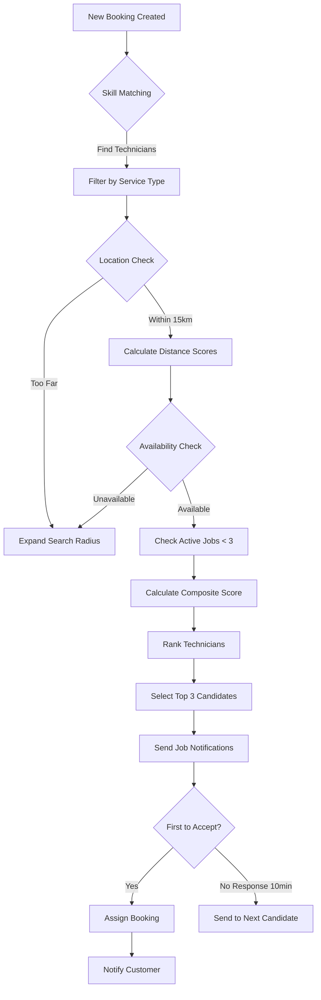
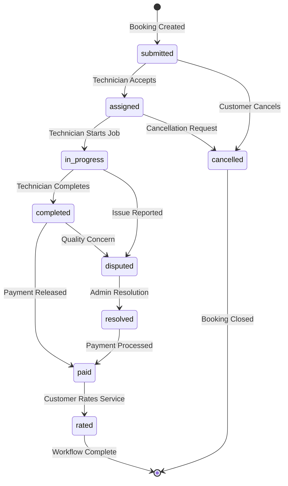
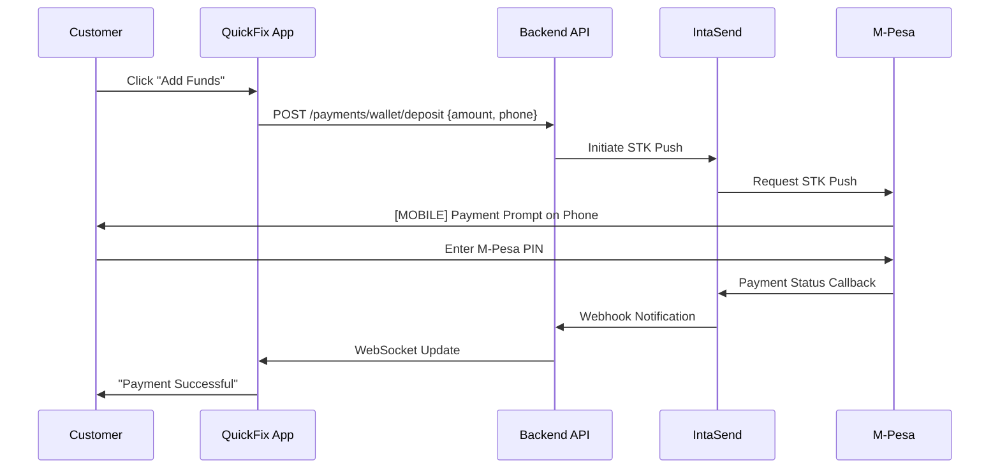

# QuickFix Documentation - Annotated Draft Part 2
**Continuation from Part 1**

---

## 4. Core Features Implementation

// Revised: Expanded each feature section with stakeholder-friendly explanations

### 4.1 Authentication System

The QuickFix authentication system provides secure, role-based access control supporting three distinct user types: Clients (customers seeking services), Technicians (service providers), and Administrators (platform managers). The system implements industry-standard security practices while maintaining user experience simplicity.

#### 4.1.1 User Registration

**Registration Process:**

1. **Data Collection**: User provides email, phone number, password, and basic profile information
2. **Validation**: System validates email format, phone number format (Kenyan format: 07XX-XXX-XXX or +2547XX-XXX-XXX), and password strength (minimum 8 characters, must include uppercase, lowercase, number)
3. **Uniqueness Check**: System verifies email and phone number are not already registered
4. **Password Security**: Password is hashed using bcrypt with 10 salt rounds before storage
5. **Account Creation**: User record created in MongoDB with initial status "pending verification"
6. **Email Verification**: Verification email sent with unique token (24-hour expiry)
7. **Confirmation**: User clicks verification link to activate account

**Technician Registration Additional Steps:**
- Technician profile section includes skills selection, service areas, years of experience
- Account created in "pending approval" status
- Admin review required before technician can accept jobs
- Verification process includes skills assessment and background check

**API Endpoint:**
```http
POST /api/auth/register
Content-Type: application/json

Request Body:
{
 "email": "user@example.com",
 "phoneNumber": "0712345678",
 "password": "SecurePass123",
 "firstName": "John",
 "lastName": "Doe",
 "role": "client",
 "technicianProfile": { // Only for technician registration
 "skills": ["plumbing", "electrical"],
 "serviceAreas": ["Nairobi", "Westlands"],
 "experience": 5
 }
}

Response (Success):
{
 "success": true,
 "message": "Registration successful. Please check your email to verify your account.",
 "userId": "507f1f77bcf86cd799439011"
}
```

#### 4.1.2 User Login

**Login Flow:**

1. **Credential Submission**: User provides email/phone and password
2. **User Lookup**: System searches for user by email or phone number
3. **Password Verification**: System compares hashed password using bcrypt
4. **Account Status Check**: System verifies account is active and verified
5. **Token Generation**: System generates JWT access token (24-hour expiry) and refresh token (7-day expiry)
6. **Response**: Tokens and user profile data returned to client
7. **Client Storage**: Mobile app stores tokens in SecureStore for subsequent API requests

**Security Features:**
- Rate limiting: Maximum 5 login attempts per 15 minutes per IP address
- Account lockout: After 10 failed attempts, account locked for 1 hour
- Suspicious activity detection: Login from new device triggers email notification
- Session management: Multiple active sessions supported (mobile + web)

**API Endpoint:**
```http
POST /api/auth/login
Content-Type: application/json

Request Body:
{
 "emailOrPhone": "user@example.com",
 "password": "SecurePass123"
}

Response (Success):
{
 "success": true,
 "message": "Login successful",
 "data": {
 "accessToken": "eyJhbGciOiJIUzI1NiIsInR5cCI6IkpXVCJ9...",
 "refreshToken": "eyJhbGciOiJIUzI1NiIsInR5cCI6IkpXVCJ9...",
 "user": {
 "id": "507f1f77bcf86cd799439011",
 "email": "user@example.com",
 "phoneNumber": "0712345678",
 "firstName": "John",
 "lastName": "Doe",
 "role": "client",
 "isVerified": true,
 "profilePicture": "https://..."
 }
 }
}
```

#### 4.1.3 Role-Based Access Control (RBAC)

**Three User Roles:**

**Client Role:**
- Create and manage service bookings
- View booking history and status
- Add funds to wallet
- Rate and review completed services
- Update personal profile
- View available technicians
- Access: All client dashboard features

**Technician Role:**
- View available job opportunities
- Accept or decline job assignments
- Update job status (start, complete)
- View earnings and transaction history
- Withdraw funds from wallet
- Manage technician profile (skills, availability, service areas)
- View ratings and customer reviews
- Access: Technician dashboard and job management features

**Administrator Role:**
- Full platform oversight and management
- User management (view, edit, suspend, delete accounts)
- Technician verification and approval
- Financial transaction monitoring
- Dispute resolution
- System configuration and settings
- Analytics and reporting access
- Emergency intervention capabilities
- Access: Complete admin dashboard with all system functions

**Middleware Implementation:**

The backend uses JWT middleware to protect routes and verify user roles:

```javascript
// middleware/auth.js - JWT token verification
const authMiddleware = (req, res, next) => {
 const token = req.headers.authorization?.split(' ')[1];
 
 if (!token) {
 return res.status(401).json({ 
 success: false, 
 message: "Access denied. No token provided." 
 });
 }
 
 try {
 const decoded = jwt.verify(token, process.env.JWT_SECRET);
 req.user = decoded; // Attach user info to request
 next();
 } catch (error) {
 return res.status(401).json({ 
 success: false, 
 message: "Invalid or expired token." 
 });
 }
};

// middleware/adminAuth.js - Admin role verification
const adminAuthMiddleware = (req, res, next) => {
 if (req.user.role !== 'admin') {
 return res.status(403).json({ 
 success: false, 
 message: "Access denied. Admin privileges required." 
 });
 }
 next();
};

// Usage in routes:
router.get('/admin/users', authMiddleware, adminAuthMiddleware, getUsersList);
router.post('/bookings/create', authMiddleware, createBooking);
router.get('/technician/jobs', authMiddleware, technicianAuthMiddleware, getAvailableJobs);
```

**Token Structure:**

JWT tokens contain the following claims:
```json
{
 "userId": "507f1f77bcf86cd799439011",
 "email": "user@example.com",
 "role": "client",
 "iat": 1698556800, // Issued at timestamp
 "exp": 1698643200 // Expiration timestamp
}
```

#### 4.1.4 Password Reset

**Reset Process:**

1. User requests password reset by providing email/phone
2. System generates unique reset token (1-hour expiry)
3. Reset link sent via email
4. User clicks link and provides new password
5. System validates token and updates password
6. All existing sessions invalidated (user must login again)
7. Confirmation email sent

**API Endpoints:**
```http
POST /api/auth/forgot-password
Content-Type: application/json

{
 "email": "user@example.com"
}

POST /api/auth/reset-password
Content-Type: application/json

{
 "token": "abc123xyz...",
 "newPassword": "NewSecurePass123"
}
```

### 4.2 Booking System

The booking system is the core workflow of QuickFix, facilitating the connection between customers needing services and technicians providing those services. The system handles booking creation, technician matching, job assignment, status tracking, and service completion.

#### 4.2.1 Service Categories

QuickFix supports the following service categories with standardized pricing and service descriptions:

| Service Type | Base Price (KES) | Description | Typical Duration |
|-------------|------------------|-------------|------------------|
| Plumbing | 1,500 | Pipe repairs, installations, leak fixing | 2-4 hours |
| Electrical | 2,000 | Wiring, outlet installation, troubleshooting | 2-3 hours |
| Carpentry | 1,800 | Furniture assembly, repairs, custom work | 3-5 hours |
| Appliance Repair | 1,500 | Washing machine, refrigerator, oven repairs | 1-3 hours |
| HVAC | 2,500 | AC installation, repair, maintenance | 2-4 hours |
| Painting | 3,000 | Interior/exterior painting, finishing | Full day |
| Locksmith | 1,200 | Lock installation, key duplication, security | 1-2 hours |
| Cleaning | 2,000 | Deep cleaning, move-in/out cleaning | 3-6 hours |
| Landscaping | 2,500 | Lawn care, garden maintenance, design | Half/Full day |
| General Maintenance | 1,500 | Miscellaneous repairs and maintenance | Variable |

**Pricing Components:**
- **Base Service Fee**: Listed price in table above
- **Travel Fee**: KES 200 (covers technician transportation)
- **Platform Fee**: 20% of base service fee (retained by QuickFix)
- **Additional Charges**: Materials, extra hours charged separately by technician

#### 4.2.2 Booking Creation Workflow

**Step-by-Step Process:**

1. **Service Selection**: Customer selects service type from category list
2. **Location Input**: Customer provides service location using:
 - Current device location (GPS)
 - Manual address entry
 - Interactive map selection (Nairobi bounds)
3. **Schedule Selection**: Customer chooses preferred date/time or "ASAP" option
4. **Description**: Customer provides detailed service description
5. **Contact Information**: 
 - Registered users: Auto-filled from profile
 - Guest users: Manual phone number entry
6. **Price Display**: System shows estimated cost breakdown
7. **Confirmation**: Customer reviews details and submits booking
8. **Booking Created**: System generates unique booking ID and stores in database

**Booking Data Structure:**

```javascript
// Booking Schema (simplified)
{
 _id: ObjectId("..."), // MongoDB unique identifier
 bookingId: "QF-20251029-ABC123", // Human-readable ID
 clientPhone: "0712345678", // Customer contact
 userId: ObjectId("..."), // Reference to User if registered
 serviceType: "plumbing",
 description: "Leaking kitchen sink, need urgent repair",
 location: {
 address: "Westlands, Nairobi",
 coordinates: {
 latitude: -1.2652,
 longitude: 36.8097
 },
 detailedAddress: "123 Muthithi Road, Westlands"
 },
 scheduledDate: ISODate("2025-10-30T10:00:00Z"),
 urgency: "normal", // "asap" or "scheduled"
 pricing: {
 basePrice: 1500,
 travelFee: 200,
 platformFee: 300, // 20% of basePrice
 totalAmount: 2000, // basePrice + travelFee
 technicianEarnings: 1400 // basePrice - platformFee + travelFee
 },
 status: "submitted", // Workflow status
 technicianId: null, // Assigned later
 timestamps: {
 created: ISODate("2025-10-29T14:30:00Z"),
 updated: ISODate("2025-10-29T14:30:00Z"),
 assigned: null,
 started: null,
 completed: null
 }
}
```

**API Endpoint:**

```http
POST /api/bookings/create
Authorization: Bearer {token} // Optional for guest bookings
Content-Type: application/json

Request Body:
{
 "serviceType": "plumbing",
 "description": "Leaking kitchen sink, need urgent repair",
 "location": {
 "address": "Westlands, Nairobi",
 "coordinates": {
 "latitude": -1.2652,
 "longitude": 36.8097
 }
 },
 "scheduledDate": "2025-10-30T10:00:00Z",
 "clientPhone": "0712345678",
 "urgency": "normal"
}

Response (Success):
{
 "success": true,
 "message": "Booking created successfully",
 "data": {
 "bookingId": "QF-20251029-ABC123",
 "_id": "507f1f77bcf86cd799439011",
 "estimatedPrice": 2000,
 "status": "submitted",
 "message": "We're finding the best technician for your job. You'll receive a notification once assigned."
 }
}
```

#### 4.2.3 Technician Matching Algorithm

// Added: Detailed explanation of matching algorithm

The system uses an intelligent matching algorithm to assign the most suitable technician to each booking. The algorithm considers multiple factors to optimize for quality, proximity, and availability.

**Matching Criteria (Priority Order):**

1. **Skill Match** (Weight: 40%)
 - Technician must have the required service skill in their profile
 - Years of experience in the specific skill considered
 - Specialization level (primary skill vs secondary skill)

2. **Geographic Proximity** (Weight: 30%)
 - Calculate distance between technician location and service location
 - Preference given to technicians within 5km radius
 - Maximum matching distance: 15km

3. **Availability Status** (Weight: 15%)
 - Technician must be marked as "available" in system
 - Check current active jobs (max 3 concurrent jobs)
 - Verify technician can meet scheduled time

4. **Performance Rating** (Weight: 10%)
 - Average customer rating (minimum 3.5 stars to receive jobs)
 - Higher-rated technicians prioritized for premium bookings
 - Recent performance trend considered

5. **Response History** (Weight: 5%)
 - Job acceptance rate (preference for >70% acceptance)
 - Average response time to job offers
 - Completion rate for accepted jobs

**Matching Algorithm Flow:**



**Caption**: Technician matching algorithm flowchart showing the step-by-step process from booking creation to technician assignment.

**Scoring Formula:**

```javascript
// Composite score calculation
const calculateTechnicianScore = (technician, booking) => {
 const skillScore = calculateSkillScore(technician.skills, booking.serviceType) * 0.40;
 const proximityScore = calculateProximityScore(technician.location, booking.location) * 0.30;
 const availabilityScore = calculateAvailabilityScore(technician.status, technician.activeJobs) * 0.15;
 const ratingScore = (technician.averageRating / 5.0) * 0.10;
 const responseScore = (technician.acceptanceRate / 100) * 0.05;
 
 return skillScore + proximityScore + availabilityScore + ratingScore + responseScore;
};

// Example scores:
// Technician A: (1.0 * 0.40) + (0.9 * 0.30) + (1.0 * 0.15) + (0.92 * 0.10) + (0.85 * 0.05) = 0.957
// Technician B: (1.0 * 0.40) + (0.6 * 0.30) + (0.7 * 0.15) + (0.96 * 0.10) + (0.90 * 0.05) = 0.826
// Result: Technician A assigned
```

#### 4.2.4 Booking Status Workflow

// Revised: Expanded status descriptions with customer and technician perspectives

**Status Lifecycle:**



**Caption**: Booking status state diagram showing all possible states and transitions throughout the service lifecycle.

**Status Definitions:**

| Status | Description | Customer Actions | Technician Actions | Duration |
|--------|-------------|------------------|-------------------|----------|
| `submitted` | Booking created, awaiting technician assignment | View details, Cancel | None | 10-30 minutes |
| `assigned` | Technician accepted job | View technician profile, Contact technician, Cancel (with fee) | Start job, Cancel (with penalty) | Until scheduled time |
| `in_progress` | Technician actively working on service | Track status, Report issues | Update progress, Complete job | Variable (1-8 hours) |
| `completed` | Service finished, awaiting payment release | Review work, Release payment, Dispute | Await payment | Up to 24 hours |
| `disputed` | Issue reported by customer or technician | Provide details, Upload evidence | Provide response, Upload evidence | 1-3 business days |
| `resolved` | Dispute settled by admin | Accept resolution | Accept resolution | Immediate |
| `paid` | Payment released to technician | Rate service | Funds in wallet | Immediate |
| `rated` | Customer provided rating and review | View receipt | View rating | Final state |
| `cancelled` | Booking cancelled by customer or technician | Request refund if applicable | None | Final state |

**Status Change Notifications:**

Each status change triggers notifications via multiple channels:
- **Email**: Detailed status update with next steps
- **SMS**: Brief status alert with booking ID (future feature)
- **Push Notification**: Instant mobile alert
- **In-App**: Real-time notification banner with action buttons

#### 4.2.5 Job Acceptance by Technician

**Technician's Perspective:**

1. **Job Notification**: Technician receives notification with job details:
 - Service type and description
 - Customer location and distance from technician
 - Scheduled date/time
 - Estimated earnings
 - Customer rating (if repeat customer)

2. **Decision Window**: Technician has 10 minutes to accept or decline

3. **Accept Action**: Technician reviews details and clicks "Accept Job"
 - System checks technician still available
 - Booking status updated to "assigned"
 - Customer receives assignment notification
 - Other notified technicians receive "job filled" message

4. **Decline Action**: Technician can decline with optional reason
 - Job offered to next best-matched technician
 - No penalty for declining (affects response rate metric only)

5. **Auto-Decline**: If no response within 10 minutes, automatically moves to next technician

**API Endpoint:**

```http
POST /api/technician/accept-job/:bookingId
Authorization: Bearer {technicianToken}
Content-Type: application/json

Request Body:
{
 "estimatedArrival": "2025-10-30T10:30:00Z", // Optional
 "notes": "I'll bring replacement parts" // Optional
}

Response (Success):
{
 "success": true,
 "message": "Job accepted successfully",
 "data": {
 "bookingId": "QF-20251029-ABC123",
 "customerPhone": "0712345678",
 "location": {...},
 "earnings": 1400,
 "scheduledTime": "2025-10-30T10:00:00Z"
 }
}
```

#### 4.2.6 Service Completion and Verification

**Completion Process:**

1. **Start Job**: Technician marks job as started when arriving at location
 - Records actual start time
 - Status changes to "in_progress"
 - Customer receives "technician started" notification

2. **Work Progress**: Technician performs service
 - Can update progress notes (optional feature)
 - Customer can contact technician if needed

3. **Complete Job**: Technician marks job as completed
 - Optional: Upload completion photos
 - Record actual end time
 - Calculate actual service duration
 - Add any additional charges (materials, extra time)
 - Status changes to "completed"

4. **Customer Verification**: Customer reviews completed work
 - Can accept or report issues
 - If accepted, proceeds to payment release
 - If disputed, enters dispute resolution workflow

**Completion API:**

```http
POST /api/technician/complete-job/:bookingId
Authorization: Bearer {technicianToken}
Content-Type: multipart/form-data

Request Body:
{
 "completionNotes": "Fixed leak, replaced valve and pipes",
 "actualDuration": 180, // minutes
 "additionalCharges": [
 {
 "description": "Replacement valve",
 "amount": 500
 }
 ],
 "completionPhotos": [File, File] // Optional
}

Response (Success):
{
 "success": true,
 "message": "Job marked as completed",
 "data": {
 "bookingId": "QF-20251029-ABC123",
 "status": "completed",
 "finalAmount": 2500, // Original + additional charges
 "awaitingCustomerVerification": true
 }
}
```

### 4.3 Payment Integration (IntaSend)

// Revised: Comprehensive payment section with production environment details

The QuickFix payment system integrates with IntaSend, a leading payment gateway in Kenya, to provide secure M-Pesa mobile money transactions. The implementation uses direct HTTPS API calls for better error handling and timeout management compared to SDK implementations.

#### 4.3.1 IntaSend Configuration

**Environment: PRODUCTION (LIVE)**

The platform operates in live production mode using real IntaSend credentials:

```javascript
// backend/services/IntaSendService.js configuration
const INTASEND_CONFIG = {
 publishableKey: process.env.INTASEND_PUBLISHABLE_KEY, // ISPubKey_live_a8e1266e...
 secretKey: process.env.INTASEND_SECRET_KEY, // ISSecretKey_live_9543caf6...
 environment: 'live', // Production environment
 apiUrl: 'https://payment.intasend.com/api/v1/'
};
```

**Environment Variables:**

```bash
# .env configuration
INTASEND_PUBLISHABLE_KEY=ISPubKey_live_a8e1266e-b13c-46f2-895c-7f06e2b52ff5
INTASEND_SECRET_KEY=ISSecretKey_live_9543caf6-ec49-4803-959e-f3ef89f97640
INTASEND_ENVIRONMENT=live
```

**Security Considerations:**
- Secret key never exposed to frontend applications
- API calls always originate from backend server
- Request signing using HMAC-SHA256 for callback verification
- TLS 1.2+ encryption for all communications

#### 4.3.2 Wallet System

// Added: Comprehensive wallet system explanation

Every user (both customers and technicians) has an associated digital wallet for managing funds within the QuickFix platform. The wallet system provides secure fund storage, transaction tracking, and seamless payment processing.

**Wallet Schema:**

```javascript
{
 _id: ObjectId("..."),
 userId: ObjectId("..."), // Reference to User
 balance: {
 available: 5000, // Immediately usable funds (KES)
 escrow: 1500, // Funds held for active bookings
 pending: 0, // Incoming funds being processed
 total: 6500 // available + escrow + pending
 },
 transactions: [
 {
 transactionId: "TXN-20251029-XYZ789",
 type: "deposit", // deposit, withdrawal, escrow_deposit, escrow_release, payment
 amount: 2000,
 status: "completed",
 description: "M-Pesa deposit",
 timestamp: ISODate("2025-10-29T14:00:00Z"),
 reference: "MPesa-ABC123"
 }
 ],
 isActive: true,
 createdAt: ISODate("2025-10-01T00:00:00Z"),
 updatedAt: ISODate("2025-10-29T14:00:00Z")
}
```

**Wallet Operations:**

1. **Add Funds (Deposit)**
 - Customer initiates M-Pesa deposit
 - IntaSend STK push sent to customer's phone
 - Customer enters M-Pesa PIN to approve
 - Funds credited to wallet "pending" balance
 - Upon confirmation, moved to "available" balance

2. **Escrow Deposit**
 - When booking requires upfront payment
 - Funds moved from "available" to "escrow"
 - Held until service completion
 - Protects both customer and technician

3. **Escrow Release**
 - Triggered when service marked complete and verified
 - Funds moved from customer escrow to technician available balance
 - Platform fee deducted automatically
 - Transaction recorded for both parties

4. **Withdrawal**
 - Technician requests withdrawal to M-Pesa
 - Minimum withdrawal: KES 100
 - Maximum withdrawal: Available balance minus reserved amount
 - Processing time: Instant to 1 hour
 - Small processing fee may apply (future implementation)

**API Endpoints:**

```http
# Get wallet balance
GET /api/payments/wallet/balance
Authorization: Bearer {token}

Response:
{
 "success": true,
 "data": {
 "available": 5000,
 "escrow": 1500,
 "pending": 0,
 "total": 6500,
 "currency": "KES"
 }
}

# Get transaction history
GET /api/payments/wallet/transactions?page=1&limit=20
Authorization: Bearer {token}

Response:
{
 "success": true,
 "data": {
 "transactions": [...],
 "pagination": {
 "currentPage": 1,
 "totalPages": 3,
 "totalTransactions": 45
 }
 }
}
```

#### 4.3.3 M-Pesa STK Push Implementation

// Added: Detailed STK push workflow

STK (SIM Toolkit) Push is the M-Pesa feature that sends a payment prompt directly to the customer's phone, allowing them to authorize payment by entering their M-Pesa PIN.

**STK Push Workflow:**



**Caption**: M-Pesa STK Push sequence diagram showing the complete payment authorization flow from user action to confirmation.

**Implementation Code:**

```javascript
// backend/services/IntaSendService.js

async initiateSTKPush(phoneNumber, amount, bookingId) {
 try {
 // Format phone number (remove leading 0, add country code)
 const formattedPhone = phoneNumber.startsWith('0') 
 ? '254' + phoneNumber.substring(1) 
 : phoneNumber;
 
 // Prepare request
 const requestData = {
 phone_number: formattedPhone,
 amount: amount,
 currency: 'KES',
 api_ref: bookingId, // Reference for tracking
 callback_url: `${process.env.BACKEND_URL}/api/payments/intasend-callback`
 };
 
 // Send STK push request
 const response = await axios.post(
 `${this.apiUrl}payment/mpesa-stk-push/`,
 requestData,
 {
 headers: {
 'Authorization': `Bearer ${this.secretKey}`,
 'Content-Type': 'application/json'
 },
 timeout: 30000 // 30 second timeout
 }
 );
 
 return {
 success: true,
 invoice_id: response.data.invoice.invoice_id,
 state: response.data.invoice.state,
 message: 'STK push sent. Please check your phone.'
 };
 
 } catch (error) {
 console.error('STK Push Error:', error.response?.data || error.message);
 throw new Error('Payment initiation failed');
 }
}
```

**Customer Experience:**

1. Customer clicks "Add Funds" and enters amount (e.g., KES 2000)
2. Customer sees loading screen: "Sending payment request to your phone..."
3. Within 5-10 seconds, M-Pesa prompt appears on customer's phone
4. Prompt shows:
 - Amount: KES 2000
 - Recipient: QuickFix
 - Reference: [Booking/Transaction ID]
5. Customer enters M-Pesa PIN
6. Customer receives M-Pesa confirmation SMS
7. QuickFix app shows "Payment successful! Funds added to your wallet."

**Error Handling:**

- **User Cancels**: If user cancels M-Pesa prompt, transaction marked as "cancelled"
- **Insufficient Balance**: M-Pesa rejects, user notified to add M-Pesa funds
- **Timeout**: If no response after 60 seconds, transaction marked "pending" for manual verification
- **Network Failure**: Automatic retry with exponential backoff

#### 4.3.4 Callback Handling and Verification

// Added: Webhook callback security implementation

IntaSend sends webhook callbacks to notify the QuickFix backend when payment status changes (completed, failed, cancelled). Proper callback handling ensures accurate fund crediting and transaction synchronization.

**Callback Endpoint:**

```javascript
// backend/routes/payments.js

router.post('/intasend-callback', async (req, res) => {
 try {
 // 1. Verify callback authenticity
 const signature = req.headers['x-intasend-signature'];
 const isValid = verifyWebhookSignature(req.body, signature, process.env.INTASEND_SECRET_KEY);
 
 if (!isValid) {
 console.error('Invalid webhook signature');
 return res.status(401).json({ error: 'Unauthorized' });
 }
 
 // 2. Extract payment data
 const { invoice, status, api_ref } = req.body;
 
 // 3. Update transaction status
 const transaction = await Transaction.findOne({ 
 reference: invoice.invoice_id 
 });
 
 if (!transaction) {
 console.error('Transaction not found:', invoice.invoice_id);
 return res.status(404).json({ error: 'Transaction not found' });
 }
 
 // 4. Process based on status
 if (status === 'COMPLETE') {
 // Credit wallet
 await creditWallet(transaction.userId, transaction.amount.value);
 
 // Update transaction
 transaction.status = 'completed';
 transaction.completedAt = new Date();
 await transaction.save();
 
 // Send notification
 await NotificationService.send(transaction.userId, {
 title: 'Payment Successful',
 message: `KES ${transaction.amount.value} has been added to your wallet.`,
 type: 'payment_success'
 });
 
 // Emit WebSocket event for real-time update
 socketIO.to(transaction.userId.toString()).emit('payment_completed', {
 amount: transaction.amount.value,
 newBalance: await getWalletBalance(transaction.userId)
 });
 } else if (status === 'FAILED') {
 transaction.status = 'failed';
 await transaction.save();
 
 await NotificationService.send(transaction.userId, {
 title: 'Payment Failed',
 message: 'Your payment could not be processed. Please try again.',
 type: 'payment_failed'
 });
 }
 
 // 5. Acknowledge receipt
 return res.status(200).json({ message: 'Callback processed successfully' });
 
 } catch (error) {
 console.error('Callback processing error:', error);
 return res.status(500).json({ error: 'Internal server error' });
 }
});

// Signature verification function
function verifyWebhookSignature(payload, signature, secret) {
 const crypto = require('crypto');
 const hmac = crypto.createHmac('sha256', secret);
 const computedSignature = hmac.update(JSON.stringify(payload)).digest('hex');
 return computedSignature === signature;
}
```

**Callback Processing Best Practices:**

1. **Idempotency**: Same callback processed multiple times produces same result
2. **Signature Verification**: Always verify IntaSend signature before processing
3. **Fast Response**: Return 200 OK quickly, process asynchronously if needed
4. **Error Logging**: Log all callback data for debugging and reconciliation
5. **Retry Logic**: IntaSend retries failed callbacks with exponential backoff

### 4.4 Notification System

// Revised: Multi-channel notification architecture

The QuickFix notification system ensures users stay informed about booking updates, payment confirmations, and important platform events through multiple communication channels.

#### 4.4.1 Notification Channels

**1. Email Notifications (Gmail SMTP)**

Primary channel for detailed notifications and confirmations.

**Configuration:**
```javascript
// backend/services/NotificationService.js

const nodemailer = require('nodemailer');

const emailTransporter = nodemailer.createTransport({
 service: 'gmail',
 auth: {
 user: process.env.GMAIL_USER, // quickfix.notifications@gmail.com
 pass: process.env.GMAIL_APP_PASSWORD // App-specific password
 }
});
```

**Email Templates:**
- **Booking Confirmation**: Booking details, technician info, estimated cost
- **Assignment Notification**: Technician profile, contact info, scheduled time
- **Payment Receipt**: Transaction details, wallet balance, invoice PDF
- **Status Updates**: Job started, completed, cancelled notifications
- **Weekly Summary**: Booking history, spending summary, recommendations

**Sample Email Structure:**
```html
<!DOCTYPE html>
<html>
<head>
 <style>
 .email-container { max-width: 600px; margin: 0 auto; font-family: Arial, sans-serif; }
 .header { background: #007bff; color: white; padding: 20px; }
 .content { padding: 20px; }
 .button { background: #28a745; color: white; padding: 12px 24px; text-decoration: none; }
 </style>
</head>
<body>
 <div class="email-container">
 <div class="header">
 <h1>QuickFix Service Update</h1>
 </div>
 <div class="content">
 <h2>Booking Confirmed</h2>
 <p>Hello {{firstName}},</p>
 <p>Your service booking has been confirmed:</p>
 <ul>
 <li>Booking ID: {{bookingId}}</li>
 <li>Service: {{serviceType}}</li>
 <li>Scheduled: {{scheduledDate}}</li>
 <li>Location: {{location}}</li>
 <li>Total Cost: KES {{totalAmount}}</li>
 </ul>
 <p>We're now finding the best technician for your job.</p>
 <a href="{{trackingUrl}}" class="button">Track Booking</a>
 </div>
 </div>
</body>
</html>
```

**2. Push Notifications (Expo)**

Instant mobile alerts for time-sensitive updates.

**Implementation:**
```javascript
// backend/services/NotificationService.js

const { Expo } = require('expo-server-sdk');
const expo = new Expo();

async sendPushNotification(userId, title, message, data = {}) {
 try {
 // Get user's push token
 const user = await User.findById(userId);
 if (!user || !user.pushToken) {
 console.log('No push token for user:', userId);
 return;
 }
 
 // Validate token
 if (!Expo.isExpoPushToken(user.pushToken)) {
 console.error('Invalid Expo push token:', user.pushToken);
 return;
 }
 
 // Prepare notification
 const message = {
 to: user.pushToken,
 sound: 'default',
 title: title,
 body: message,
 data: data,
 priority: 'high',
 badge: 1
 };
 
 // Send notification
 const chunks = expo.chunkPushNotifications([message]);
 const tickets = [];
 
 for (let chunk of chunks) {
 const ticketChunk = await expo.sendPushNotificationsAsync(chunk);
 tickets.push(...ticketChunk);
 }
 
 console.log('Push notification sent:', tickets);
 return tickets;
 
 } catch (error) {
 console.error('Push notification error:', error);
 }
}
```

**Push Notification Types:**
- **Job Available**: New job matching technician's skills
- **Booking Assigned**: Technician accepted your booking
- **Status Change**: Job started, completed, or cancelled
- **Payment Confirmed**: Funds added to wallet
- **Message Received**: Communication from customer/technician (future)
- **Urgent Alert**: Emergency service request, dispute escalation

**3. In-App Notifications (Socket.IO)**

Real-time updates while user has app open.

**Implementation:**
```javascript
// backend/config/socket.js

io.on('connection', (socket) => {
 console.log('User connected:', socket.id);
 
 // Join user to their personal room
 socket.on('join', (userId) => {
 socket.join(userId);
 console.log(`User ${userId} joined room`);
 });
 
 // Disconnect handling
 socket.on('disconnect', () => {
 console.log('User disconnected:', socket.id);
 });
});

// Emit notification to specific user
function emitNotification(userId, notification) {
 io.to(userId).emit('notification', {
 id: notification._id,
 title: notification.title,
 message: notification.message,
 type: notification.type,
 timestamp: notification.createdAt,
 data: notification.data
 });
}
```

**Frontend Connection:**
```javascript
// app/contexts/SocketContext.js

import { io } from 'socket.io-client';

const socket = io(API_BASE_URL, {
 transports: ['websocket'],
 auth: {
 token: authToken
 }
});

socket.on('connect', () => {
 console.log('Connected to server');
 socket.emit('join', userId);
});

socket.on('notification', (notification) => {
 // Show in-app notification banner
 showNotificationBanner(notification.title, notification.message);
 
 // Update notification list
 addToNotificationList(notification);
 
 // Play sound/vibration
 if (notification.type === 'urgent') {
 playUrgentSound();
 }
});
```

#### 4.4.2 Notification Management

**Notification Schema:**

```javascript
{
 _id: ObjectId("..."),
 userId: ObjectId("..."), // Recipient
 title: "Booking Confirmed",
 message: "Your plumbing service booking has been confirmed.",
 type: "booking_update", // booking_update, payment, system, urgent
 priority: "normal", // low, normal, high, urgent
 isRead: false,
 channels: ["email", "push", "in_app"], // Delivery channels used
 data: { // Additional context data
 bookingId: "QF-20251029-ABC123",
 actionUrl: "/booking/details/507f1f77bcf86cd799439011"
 },
 createdAt: ISODate("2025-10-29T14:30:00Z"),
 readAt: null
}
```

**User Preferences:**

Users can customize notification preferences:

```javascript
// User notification settings
{
 notificationPreferences: {
 email: {
 bookingUpdates: true,
 paymentReceipts: true,
 marketingEmails: false,
 weeklyReports: true
 },
 push: {
 bookingUpdates: true,
 messages: true,
 marketing: false,
 soundEnabled: true,
 vibrationEnabled: true
 },
 sms: { // Future implementation
 bookingUpdates: false,
 paymentConfirmations: true
 }
 }
}
```

**API Endpoints:**

```http
# Get all notifications
GET /api/notifications?page=1&limit=20&unreadOnly=true
Authorization: Bearer {token}

Response:
{
 "success": true,
 "data": {
 "notifications": [...],
 "unreadCount": 5,
 "pagination": {...}
 }
}

# Mark notification as read
PUT /api/notifications/:notificationId/read
Authorization: Bearer {token}

# Mark all as read
PUT /api/notifications/read-all
Authorization: Bearer {token}

# Update notification preferences
PUT /api/notifications/preferences
Authorization: Bearer {token}
Content-Type: application/json

{
 "email": {
 "bookingUpdates": true,
 "marketingEmails": false
 },
 "push": {
 "soundEnabled": false
 }
}
```

### 4.5 Rating & Review System

// Revised: Comprehensive quality assurance system

The rating system enables customers to evaluate service quality and helps maintain platform standards by tracking technician performance.

#### 4.5.1 Rating Process

**Post-Service Rating:**

1. **Trigger**: After booking status changes to "paid" (payment released)
2. **Notification**: Customer receives rating request via push notification and email
3. **Rating Window**: 7 days to submit rating (optional, not mandatory)
4. **Rating Components**:
 - **Star Rating**: 1-5 stars (required)
 - **Written Review**: Text feedback (optional, max 500 characters)
 - **Service Aspects**: Punctuality, professionalism, quality, communication (optional)
 - **Would Recommend**: Yes/No question

**Rating Schema:**

```javascript
{
 _id: ObjectId("..."),
 bookingId: ObjectId("..."),
 customerId: ObjectId("..."),
 technicianId: ObjectId("..."),
 rating: {
 overall: 4.5, // 1-5 scale
 aspects: {
 punctuality: 5,
 professionalism: 4,
 quality: 5,
 communication: 4
 }
 },
 review: "Excellent service! Fixed my plumbing issue quickly and professionally.",
 wouldRecommend: true,
 isVerified: true, // Verified booking completion
 response: null, // Technician's response to review (optional)
 createdAt: ISODate("2025-10-30T10:00:00Z"),
 updatedAt: ISODate("2025-10-30T10:00:00Z")
}
```

**API Endpoint:**

```http
POST /api/bookings/:bookingId/rate
Authorization: Bearer {customerToken}
Content-Type: application/json

Request Body:
{
 "rating": {
 "overall": 4.5,
 "aspects": {
 "punctuality": 5,
 "professionalism": 4,
 "quality": 5,
 "communication": 4
 }
 },
 "review": "Excellent service! Fixed my plumbing issue quickly and professionally.",
 "wouldRecommend": true
}

Response:
{
 "success": true,
 "message": "Rating submitted successfully. Thank you for your feedback!",
 "data": {
 "ratingId": "507f1f77bcf86cd799439011",
 "technicianNewRating": 4.7 // Updated average
 }
}
```

#### 4.5.2 Technician Performance Metrics

**Calculated Metrics:**

```javascript
// Technician rating object
{
 averageRating: 4.7, // Overall average from all ratings
 totalRatings: 156,
 ratingDistribution: {
 5: 120, // Count of 5-star ratings
 4: 30,
 3: 5,
 2: 1,
 1: 0
 },
 aspectAverages: {
 punctuality: 4.8,
 professionalism: 4.7,
 quality: 4.9,
 communication: 4.6
 },
 recommendationRate: 0.95, // 95% would recommend
 responseTime: {
 average: 45, // minutes to accept jobs
 median: 30
 },
 completionRate: 0.98, // 98% of accepted jobs completed
 acceptanceRate: 0.75 // 75% of offered jobs accepted
}
```

**Performance Thresholds:**

| Metric | Minimum | Good | Excellent |
|--------|---------|------|-----------|
| Average Rating | 3.5 | 4.0 | 4.7 |
| Completion Rate | 85% | 95% | 99% |
| Recommendation Rate | 75% | 90% | 95% |
| Response Time | <120 min | <60 min | <15 min |
| Acceptance Rate | 50% | 70% | 85% |

**Consequences:**

- **Below Minimum**: Technician flagged for review, may face suspension
- **Good Performance**: Standard job assignment priority
- **Excellent Performance**: Higher job assignment priority, featured in search results, bonus opportunities

#### 4.5.3 Review Moderation

**Automated Moderation:**

- Profanity filter for inappropriate language
- Spam detection for generic/copied reviews
- Conflict of interest detection (same user rating same technician multiple times)

**Manual Review:**

Admins can:
- Flag inappropriate reviews for removal
- Verify disputed ratings
- Respond to technician appeals
- Highlight exemplary reviews

**Technician Response:**

Technicians can respond to reviews (once per review):
- Acknowledge positive feedback
- Address concerns raised in negative reviews
- Provide context for service issues

---

## 5. Administrative Features

// Added: Comprehensive admin panel documentation

### 5.1 Admin Dashboard

The QuickFix admin dashboard provides platform operators with comprehensive tools for user management, technician verification, financial oversight, and system monitoring.

**Dashboard Overview Components:**

1. **Key Performance Indicators (KPIs)**
 - Total Users (Clients + Technicians + Admins)
 - Active Bookings (Current day/week/month)
 - Total Revenue (Platform fees collected)
 - Average Rating (Platform-wide service quality)
 - Response Time (Average time from booking to assignment)

2. **Real-Time Monitoring**
 - Active jobs map (live technician locations)
 - Recent bookings list
 - Pending verifications count
 - Unresolved disputes count
 - System health indicators

3. **Quick Actions**
 - Verify pending technicians
 - Resolve open disputes
 - View recent transactions
 - Send platform-wide announcements
 - Generate reports

**API Endpoint:**

```http
GET /api/admin/dashboard/stats
Authorization: Bearer {adminToken}

Response:
{
 "success": true,
 "data": {
 "users": {
 "total": 1547,
 "clients": 1235,
 "technicians": 310,
 "admins": 2
 },
 "bookings": {
 "today": 45,
 "thisWeek": 312,
 "thisMonth": 1205,
 "pending": 12,
 "active": 8,
 "completed": 1185
 },
 "revenue": {
 "today": 12500,
 "thisWeek": 89400,
 "thisMonth": 345600,
 "currency": "KES"
 },
 "averageRating": 4.6,
 "averageResponseTime": 18, // minutes
 "pendingVerifications": 5,
 "openDisputes": 2
 }
}
```

### 5.2 User Management

**Capabilities:**

1. **View All Users**
 - Searchable/filterable list of all platform users
 - Filter by role, status, registration date, location
 - Export user data to CSV

2. **User Details**
 - Complete profile information
 - Booking history
 - Payment history
 - Ratings given/received
 - Account status and flags

3. **User Actions**
 - Edit user information
 - Reset user password
 - Suspend/unsuspend account
 - Delete account (with confirmation)
 - Send direct notification

4. **Bulk Operations**
 - Bulk suspend accounts
 - Bulk delete inactive accounts
 - Send bulk notifications

**API Endpoints:**

```http
# Get all users with filters
GET /api/admin/users?role=technician&status=active&page=1&limit=50
Authorization: Bearer {adminToken}

# Get user details
GET /api/admin/users/:userId
Authorization: Bearer {adminToken}

# Update user
PUT /api/admin/users/:userId
Authorization: Bearer {adminToken}
Content-Type: application/json

{
 "isVerified": true,
 "status": "active",
 "notes": "Admin verification completed"
}

# Suspend user
POST /api/admin/users/:userId/suspend
Authorization: Bearer {adminToken}
Content-Type: application/json

{
 "reason": "Multiple customer complaints",
 "duration": 30 // days, or null for permanent
}
```

### 5.3 Technician Verification

**Verification Process:**

1. **Application Review**
 - Technician submits registration with skills and experience
 - Application enters "pending" queue
 - Admin receives notification

2. **Document Verification**
 - National ID/passport verification
 - Skills certificates (if applicable)
 - Previous work references
 - Background check results

3. **Skills Assessment** (Optional)
 - Technical quiz for claimed skills
 - Practical demonstration for high-skill services
 - Video interview

4. **Approval Decision**
 - **Approve**: Technician activated, can receive jobs
 - **Reject**: Account denied with reason
 - **Request More Info**: Technician notified to provide additional documentation

5. **Ongoing Monitoring**
 - Regular performance review based on ratings
 - Customer complaint investigation
 - Re-verification every 12 months

**Verification Checklist:**

```javascript
{
 verification: {
 status: "pending", // pending, approved, rejected
 checks: {
 identityVerified: false,
 skillsVerified: false,
 backgroundCheck: false,
 referencesChecked: false
 },
 documents: [
 {
 type: "national_id",
 url: "https://...",
 status: "pending",
 reviewedBy: null,
 reviewedAt: null
 }
 ],
 notes: "Plumbing certificate looks legitimate. Need to verify with issuing institution.",
 reviewedBy: ObjectId("..."), // Admin ID
 reviewedAt: ISODate("2025-10-29T15:00:00Z")
 }
}
```

**API Endpoints:**

```http
# Get pending verifications
GET /api/admin/technicians/pending
Authorization: Bearer {adminToken}

# Get technician verification details
GET /api/admin/technicians/:technicianId/verification
Authorization: Bearer {adminToken}

# Approve technician
POST /api/admin/technicians/:technicianId/approve
Authorization: Bearer {adminToken}
Content-Type: application/json

{
 "verificationNotes": "All documents verified. Skills assessment passed.",
 "assignedServiceAreas": ["Nairobi", "Westlands", "Kilimani"]
}

# Reject technician
POST /api/admin/technicians/:technicianId/reject
Authorization: Bearer {adminToken}
Content-Type: application/json

{
 "reason": "Insufficient experience documentation",
 "allowReapply": true
}
```

### 5.3 Analytics & Reporting

// Added: Business intelligence and reporting features

**Available Reports:**

1. **Financial Reports**
 - Daily/Weekly/Monthly revenue
 - Payment method breakdown
 - Platform fees collected
 - Pending payouts to technicians
 - Refunds and disputes

2. **Booking Analytics**
 - Bookings by service type
 - Peak booking hours/days
 - Average booking value
 - Conversion rate (views to bookings)
 - Cancellation rate and reasons

3. **Technician Performance**
 - Top-rated technicians
 - Most active technicians
 - Response time averages
 - Completion rate trends
 - Earnings leaderboard

4. **Customer Insights**
 - New customer acquisition
 - Customer retention rate
 - Repeat booking rate
 - Customer lifetime value
 - Geographic distribution

5. **Platform Health**
 - System uptime
 - API response times
 - Error rates
 - Active user sessions
 - Database performance

**Report Generation:**

```http
POST /api/admin/reports/generate
Authorization: Bearer {adminToken}
Content-Type: application/json

Request Body:
{
 "reportType": "financial",
 "dateRange": {
 "start": "2025-10-01T00:00:00Z",
 "end": "2025-10-31T23:59:59Z"
 },
 "filters": {
 "serviceType": "plumbing", // Optional
 "location": "Nairobi" // Optional
 },
 "format": "pdf" // pdf, csv, excel
}

Response:
{
 "success": true,
 "message": "Report generated successfully",
 "data": {
 "reportId": "RPT-20251029-XYZ",
 "downloadUrl": "https://quickfix.com/reports/download/RPT-20251029-XYZ.pdf",
 "expiresAt": "2025-11-05T00:00:00Z"
 }
}
```

---

// Note: Note: Sections 6-16 will continue in the complete merged version
// This annotated draft part 2 focuses on completing the core features and admin sections

**[End of Annotated Draft Part 2]**

> **End of Annotated Draft Part 2** — Edited by GitHub Copilot on October 29, 2025

---

**Note to Documentation Team:**

This is Part 2 of the Annotated Draft. To create the complete documentation:

1. **Merge Parts 1 and 2** into a single document
2. **Add Remaining Sections** (6-16):
 - Database Design (schemas, ER diagrams, indexes)
 - API Documentation (all 80+ endpoints)
 - Security Implementation
 - Testing Strategy (unit, integration, E2E, CI/CD)
 - Deployment Guide (environment setup, CI/CD pipelines)
 - Maintenance & Monitoring
 - Future Enhancements (Q1-Q3 2026 roadmap)
 - Known Issues & Limitations
 - Conclusion & Recommendations
 - References
 - Appendices

3. **Generate Clean Final Version** removing all diff markers () for publication

4. **Create Diagrams** from Mermaid code using diagram generation tools

5. **Export to PDF/Word** for stakeholder distribution
